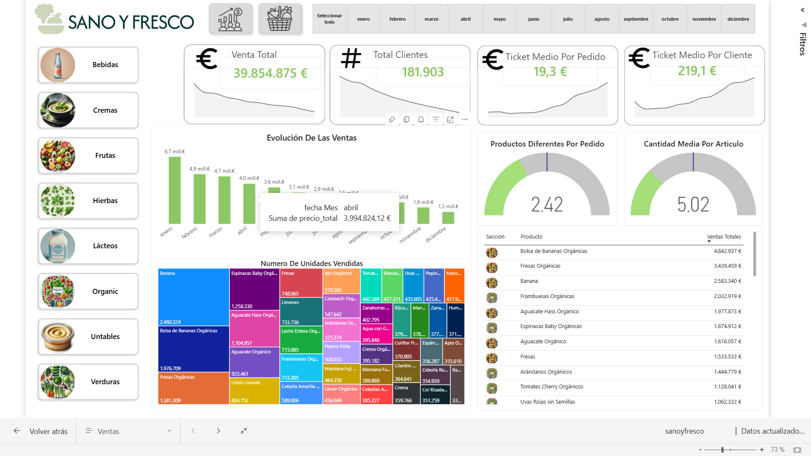
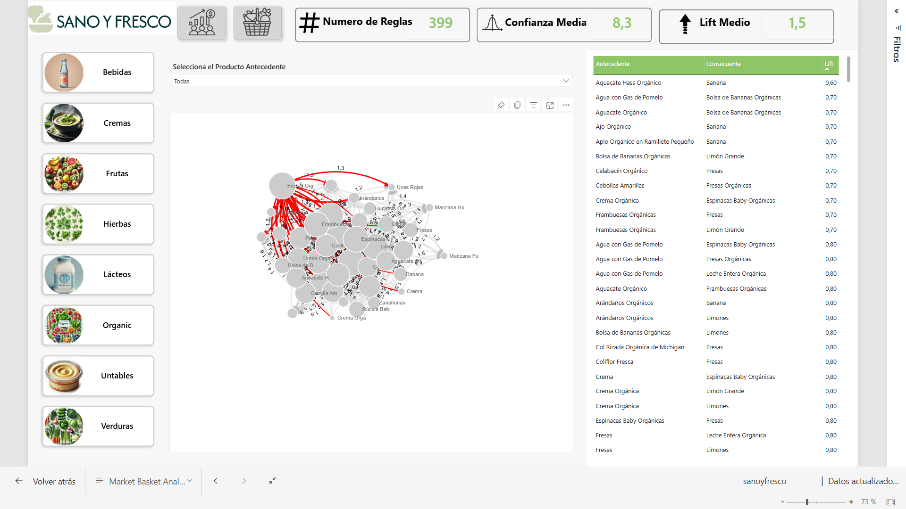

# 🛒 Sano y Fresco: Análisis Comercial y Market Basket Analysis

Bienvenido al repositorio del proyecto "Sano y Fresco". Este proyecto es un análisis de inteligencia de negocios *end-to-end* orientado al sector retail, donde transformamos datos transaccionales de ventas en insights accionables para la optimización de inventarios y estrategias de *cross-selling* (venta cruzada).

---

## 🎯 Contexto y Preguntas de Negocio
El objetivo principal del proyecto fue analizar casi 5 millones de registros transaccionales para responder a preguntas clave del negocio y proponer soluciones basadas en datos:
*   ¿Cuál es la salud financiera general de la sucursal (Ingresos mensuales, Ticket Medio por cliente)?
*   ¿Cuáles son los productos "estrella" con mayor rotación?
*   ¿Qué patrones ocultos de compra cruzada existen entre nuestros clientes para rediseñar el acomodo físico en tienda e impulsar promociones?

*En los documentos adjuntos de este repositorio se encuentra el detalle de la toma de requerimientos y la justificación de la solución propuesta.*

---

## (Power BI)
Desarrollo de paneles interactivos para el monitoreo de KPIs y Market Basket Analysis.
🌐 **[Interactuar con el Dashboard en línea (Power BI Service)](https://app.powerbi.com/view?r=eyJrIjoiMmRjMzFiMmYtODIyNS00YjhlLTgwN2UtMjk5Y2I0ODQ2MzcwIiwidCI6ImNhY2E5MDExLTdiNmEtNDRkZS04NjFmLTA5NWEyY2E4ODNiNyIsImMiOjR9)**  
📥 **[Descargar archivo del modelo para escritorio (.pbix)](sanoyfresco.pbix)**

### Panel Principal: Ventas y Rentabilidad
Este panel permite a los gerentes monitorizar el volumen de transacciones, los ingresos y los productos más vendidos mediante gráficos de árbol (*Treemap*).

### Panel Analítico: Market Basket Analysis
Panel diseñado para visualizar las reglas de asociación descubiertas (más de 300 patrones de compra), filtradas por su nivel de *Confianza* y *Lift*.

**

---

## 🛠️ El Proceso de Datos (Python y SQLite)
Todo el proceso de ingeniería de datos, desde la limpieza hasta el modelado matemático, se encuentra documentado paso a paso en el archivo **`TPE_MarketBasketAnalysis_colab.ipynb`**.
[Haz clic aquí para ver el código completo del análisis en Python (Jupyter Notebook)](TPE_MarketBasketAnalysis_colab/TPE_MarketBasketAnalysis_colab.ipynb)

*   **Extracción (ETL):** Conexión directa a la base de datos relacional mediante `sqlite3` y extracción a DataFrames usando `pandas`.
*   **Transformación y One-Hot Encoding:** Preparación de los datos transaccionales creando matrices binarias de compra por cliente.
*   **Modelo Analítico:** Desarrollo de funciones personalizadas en Python para calcular métricas estadísticas (*Soporte, Confianza, Lift*) utilizando `itertools.combinations`, logrando identificar relaciones de compra sólidas para el negocio.

---

## 🏆 Créditos y Agradecimientos
Este proyecto fue desarrollado como parte de mi formación continua en inteligencia de negocios y ciencia de datos. Un agradecimiento especial a **Data Science For Business** por la excelente estructura formativa y la guía proporcionada a lo largo del curso para llevar este proyecto a la realidad.

*   **Sitio web:** [datascience4business.com](https://datascience4business.com/)
*   **Canal de YouTube:** [Data Science For Business](https://www.youtube.com/@DataScienceForBusiness)
